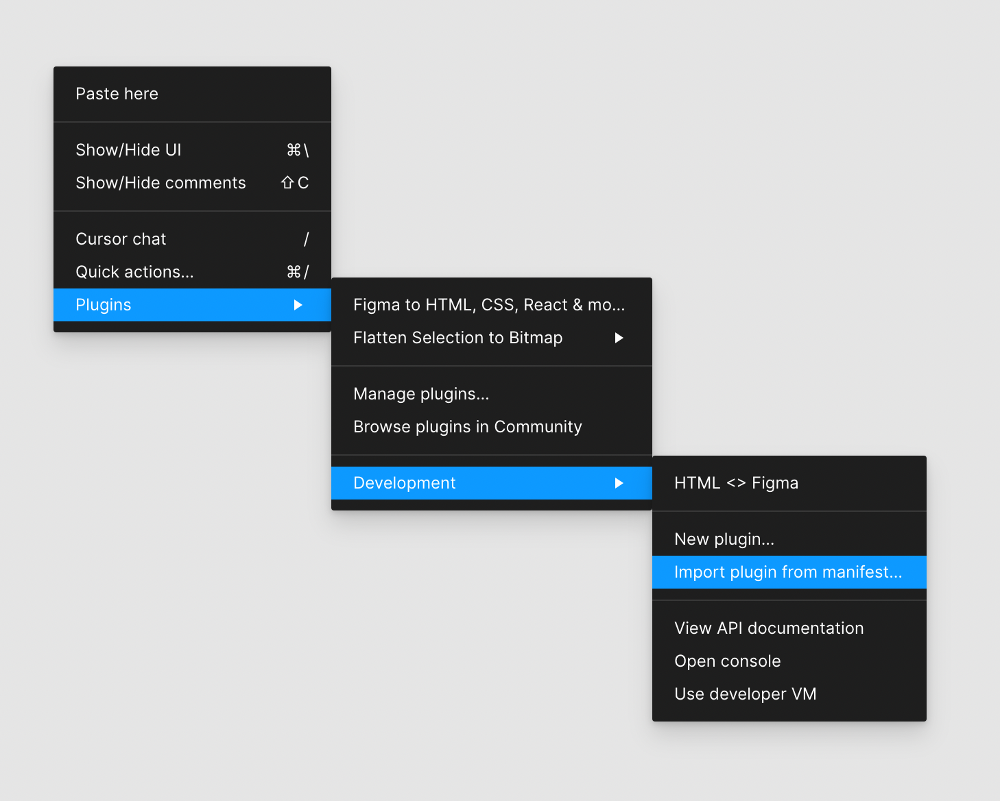
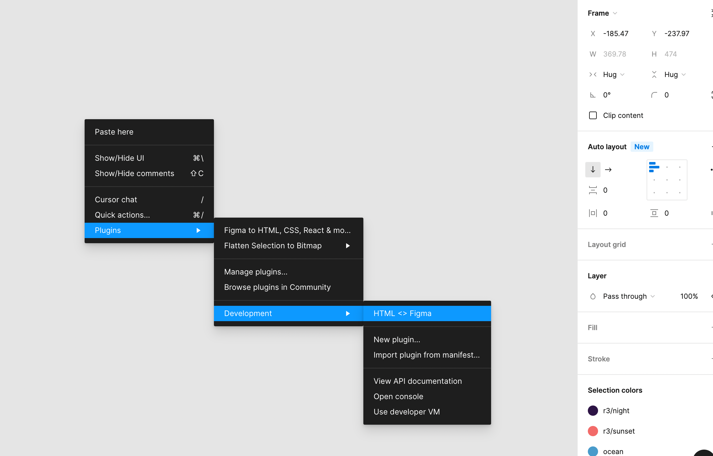

# Developing

## Architecture

- `builder.io/api/v1/html-to-figma`: API endpoint that converts a URL's layout to a Figma design. The logic of that endpoint lives in _this_ repo, under [./lib/html-to-figma](./lib/html-to-figma).
- `builder.io/api/v1/figma-to-builder`: API endpoint that converts a Figma design to a Builder content JSON. The logic of that endpoint lives in Builder's API codebase.

## Developing the Figma plugin

### Setup plugin for local dev

- install the Figma desktop app through https://www.figma.com/

- Right click Plugins -> Development -> Import plugin from manifest
  

- Choose `manifest.json` in this repo

- Now you can access/test the local plugin code in this repo by navigating to: Right click `Plugins` -> `Development` -> `HTML <> Figma`
  

PS: the local plugin will be in a different menu from the published plugin, which can be accessed from `Plugins` -> `Figma to HTML, CSS, React & More` (notice the names are different too).

### Develop

```bash
# install
npm install

# run tsc server
npm run dev
```

NOTE: make sure to enable this boolean:

https://github.com/BuilderIO/figma-html/blob/db81565798c2989f701ae2b6b0aeaff175b9108b/plugin/ui.tsx#L45

### `Figma -> Builder` workflow

#### General workflow

When the user clicks on `Generate Code` or `Download JSON` buttons in the Figma UI, the following will happen:

- in `plugin/ui.tsx`, the plugin will `postMessage` to the parent `window`, requesting the selected elements.
- in `plugin/code.ts`, the code will serialize the selected elements and pass them back to the UI iframe.
- in `plugin/ui.tsx`, once the elements are received, it will POST them to the `api/v1/figma-to-builder` API endpoint.

### How to test & develop

The best way to test & develop is to open a Figma project with a few elements, that has the bug you're trying to fix.

If the change you're making is in the Plugin code, then:

- Make the changes you need, and re-open the plugin (this will cause it to reload)
- Try to export the Figma elements again by clicking on the `Generate Code` button.
- See if the output in the Fiddle is now fixed

If the change you're making is in the API code, then:

- Save your Figma JSON by clicking on the `Download JSON` button. You will keep reusing this JSON against the local API.
- Open a local API Builder.io Fiddle
- Import the saved JSON by going to `Import Options` -> `Figma` -> `Upload Figma JSON`, and inspect the output.
- Keep iterating on the `figma-to-builder` API, and re-importing the JSON until you get the desired output.
